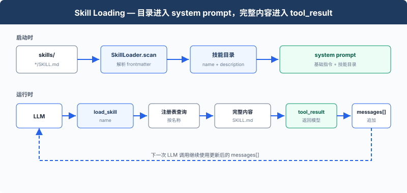

# s07: Skill Loading — 用到时再加载

> ℹ️ 下面的代码片段摘自同目录 `AgentLoop.java`（有删减，完整可运行版见该文件）。
> 相比 Python 原版，本章未搬整套 hook 框架，只在 `processToolCall` 里保留内联 deny-list。

s01 → s02 → s03 → s04 → s05 → s06 → `s07` → [s08](../s08_context_compact/) → s09 → ... → s16 → s17

> system prompt 保存技能目录；`load_skill` 返回完整的 `SKILL.md`。
>
> **Harness 层**：知识加载 — 让模型先知道有哪些技能，再按名称读取内容。

---

## 问题

假设某个项目有一套 React 组件规范、一份 SQL 风格指南和一份 API 设计文档。我们希望 Agent 在开发过程中遵守这些规范，最直接的做法就是把它们全部放进 system prompt：

```java
String system = "You are a coding agent. "
        + Files.readString(Path.of("docs/react-style.md"))
        + Files.readString(Path.of("docs/sql-style.md"))
        + Files.readString(Path.of("docs/api-design.md"));
```

这种做法能让 Agent 读到所有规范，但问题在于，三份文档被固定放进了 system prompt，无法根据当前任务只选择需要的那一份。每次调用 LLM 时，三份文档的全文都会一起发送给模型。当前任务只修改 React 组件时，实际需要的只有 React 组件规范；SQL 风格指南和 API 设计文档与任务无关，却仍然占用输入 token 和上下文窗口，留给代码、对话和工具结果的空间也会变少。

---

## 解决方案



启动时，`scanSkills()` 扫描 `skills/*/SKILL.md`，读取 YAML frontmatter 中的 `name` 和 `description`，把结果放进 `SKILL_REGISTRY`，再用 `listSkills()` 把这份目录拼进 system prompt。模型需要完整说明时，调用 `load_skill(name)`；返回的 `SKILL.md` 作为 `tool_result` 追加到消息列表。

| 内容 | 进入模型的位置 | 何时加入 |
|------|----------------|----------|
| 技能名称和描述 | system prompt | 启动时 |
| 完整 `SKILL.md` | `tool_result` | 调用 `load_skill` 时 |

---

## 工作原理

每个技能是一个包含 `SKILL.md` 的目录：

```text
skills/
  agent-builder/SKILL.md
  code-review/SKILL.md
  mcp-builder/SKILL.md
  pdf/SKILL.md
```

### 扫描技能

```java
private record SkillEntry(String name, String description, String content) {}

private static final Map<String, SkillEntry> SKILL_REGISTRY = new TreeMap<>();
static { scanSkills(); }                       // 类加载时扫描一次

private static void scanSkills() {
    if (!Files.isDirectory(SKILLS_DIR)) return;
    try (Stream<Path> subdirs = Files.list(SKILLS_DIR)) {
        subdirs.filter(Files::isDirectory)
                .sorted(Comparator.naturalOrder())
                .forEach(dir -> {
                    Path manifest = dir.resolve("SKILL.md");
                    if (!Files.isRegularFile(manifest)) return;
                    try {
                        SkillEntry e = parseSkill(Files.readString(manifest),
                                                  dir.getFileName().toString());
                        SKILL_REGISTRY.put(e.name(), e);
                    } catch (IOException ignore) {}
                });
    } catch (IOException ignore) {}
}

// 解析 SKILL.md 顶部的 YAML frontmatter，取不到就回退到目录名 / 首个非空行
private static SkillEntry parseSkill(String raw, String dirName) {
    String name = dirName, desc = firstNonEmpty(raw), content = raw;
    if (raw.startsWith("---")) {
        String[] parts = raw.split("---", 3);
        if (parts.length >= 3 && new Yaml().load(parts[1]) instanceof Map<?, ?> m) {
            if (m.get("name") != null)        name = String.valueOf(m.get("name"));
            if (m.get("description") != null) desc = String.valueOf(m.get("description")).trim();
        }
    }
    return new SkillEntry(name, desc, content);
}
```

`listSkills()` 只输出名称和描述：

```text
- **agent-builder**: Scaffolding and patterns for building Claude agents...
- **code-review**: Perform thorough code reviews...
- **pdf**: Process PDF files...
```

### 组装 system prompt

```java
private static String listSkills() {
    if (SKILL_REGISTRY.isEmpty()) return "(no skills found)";
    return SKILL_REGISTRY.values().stream()
            .map(s -> "- **" + s.name() + "**: " + s.description().split("\n", 2)[0].trim())
            .reduce((a, b) -> a + "\n" + b)
            .orElse("");
}

private static final String SYSTEM =
        "You are a coding agent at " + WORKDIR + ".\n"
                + "Skills available:\n" + listSkills() + "\n"
                + "Use load_skill to get full details when needed.";
```

固定的 Agent 指令和扫描得到的技能目录在这里组成实际传给模型的 system prompt。

### 加载完整内容

```java
private static String runLoadSkill(String name) {
    SkillEntry s = SKILL_REGISTRY.get(name);          // 查注册表，name 不会被当作文件路径
    if (s == null) return "Skill not found: " + name
            + ". Available: " + String.join(", ", SKILL_REGISTRY.keySet());
    return s.content();                               // 返回完整 SKILL.md
}
```

`name` 用于查询启动时建立的注册表，不会被当作文件路径。`dispatchTool` 把 `load_skill` 路由到这里，工具返回后，原有 Agent Loop 会把内容作为新的 `tool_result` 消息追加。

---

## 试一下

```sh
cd learn-claude-code-java
mvn -q compile exec:java -Dexec.mainClass=com.learn.cc.s07_skill_loading.AgentLoop
```

试试这些 prompt：

1. `What skills are available?`
2. `Load the code-review skill and follow its instructions`
3. `Review README.md and load the relevant skill first`

观察 system prompt 中是否只有技能目录，以及调用 `load_skill` 后是否出现完整的 `SKILL.md` 内容。

---

## 接下来

随着工具调用增加，`messages[]` 会积累较早的文件内容和工具结果。

s08 Context Compact → 缩短较早的消息，为后续调用保留上下文空间。

<!-- translation-sync: zh@v6, en@v6, ja@v6 -->
