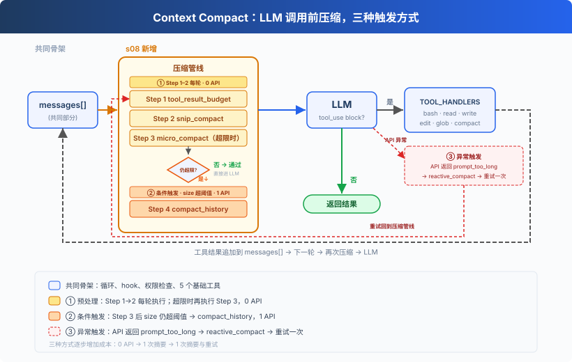
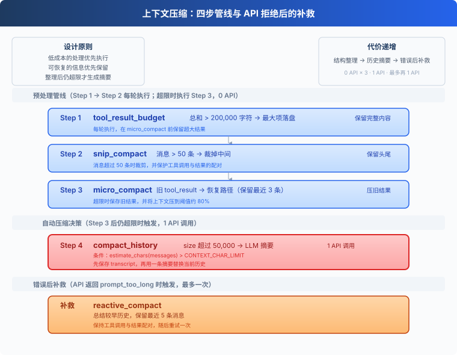
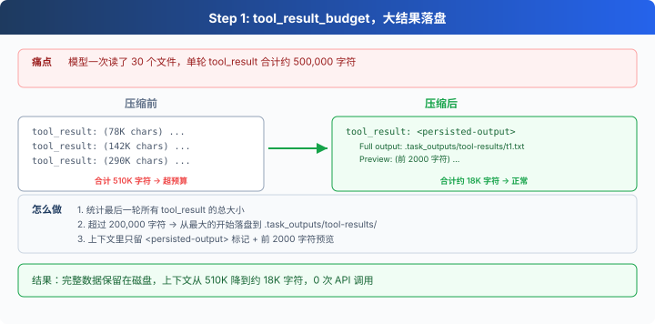
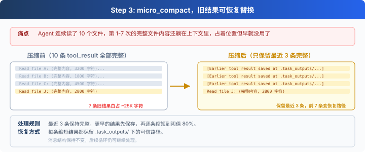
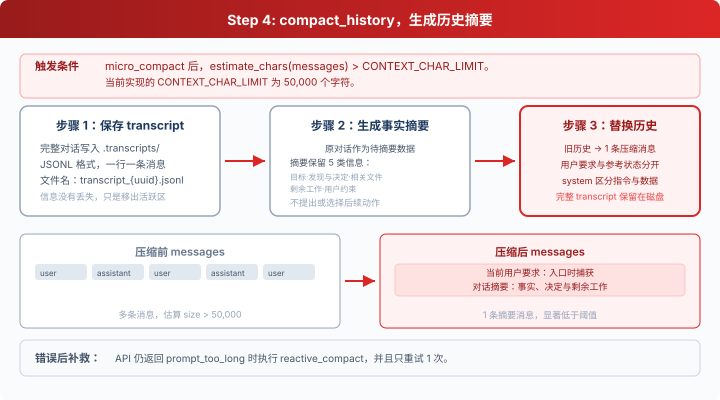

# s08: Context Compact：上下文总会满，先整理，再总结

> ℹ️ 下面的代码片段摘自同目录 `AgentLoop.java`（有删减，完整可运行版见该文件）。
> Java 内部维护一套自己的可变结构 `InternalMsg` / `InternalBlock`，调用 API 前才转成 SDK 的 `MessageParam`——
> Anthropic Java SDK 的消息类型不可变，没法像 Python 的 dict 那样原地把 `tool_result` 的内容换掉。

s01 → s02 → s03 → s04 → s05 → s06 → s07 → `s08` → [s09](../s09_memory/) → s10 → ... → s16 → s17

> *"上下文总会满，要有办法腾地方。"* 四步压缩，低成本的操作优先执行。
>
> **Harness 层**：压缩让有限的上下文持续服务于长任务。

Agent 持续工作时，读过的文件、执行过的命令和模型回复都会留在 `messages` 中。消息越积越多，最终会超过模型能够接收的上下文长度。

本节将实现一条四步压缩管线。它先整理可以恢复的工具结果，空间仍然不足时再总结历史。



## 先理解上下文

可以把上下文窗口看作模型当前使用的一张草稿纸。用户消息、模型回复、`tool_use` 和 `tool_result` 都会按顺序写在这张纸上。模型每次继续工作时，都要重新读取这些内容。

草稿纸的大小固定。内容超过上限后，API 会拒绝请求并返回 `prompt_too_long`。在代码任务里，工具结果通常占据最多空间：

- 读取一个长文件会把文件内容放进上下文；
- 测试和构建日志可能一次产生几十 KB 文本；
- 搜索多个文件会持续追加结果。

任务持续得越久，`messages` 就越大。压缩的目标是控制其中的信息量，同时尽可能保留当前目标、用户约束和正在进行的工作。

## 为什么先整理工具结果

直接让模型总结整段历史可以明显缩短上下文，但摘要一定会遗漏部分细节，而且还会多产生一次模型调用。

工具结果具有更适合优先处理的特点：

1. 大文件可以保存到磁盘，需要时重新读取。
2. 旧命令可以重新执行。
3. 最新几条结果通常比早期结果更接近当前工作。
4. 文本裁剪和结构调整不需要调用模型。

因此压缩顺序按照信息损失和调用成本排列：先转存，再裁剪，再替换旧结果，最后才生成摘要。



## 第一步：toolResultBudget

一次模型回复可能同时调用多个工具。执行完成后，这些 `tool_result` 会一起写进最后一条 user 消息。它们的总大小超过 `TOOL_RESULT_BATCH_CHAR_LIMIT = 200_000` 字符时，`toolResultBudget` 从最大的结果开始处理。

超过 `LARGE_RESULT_CHAR_LIMIT = 30_000` 的结果会完整写入：

```text
.task_outputs/tool-results/<tool_use_id>.txt
```

上下文中保留文件路径和前 2000 个字符的预览：



核心循环按照结果大小依次转存：

```java
List<InternalBlock> blocks = list.stream()
        .filter(o -> "tool_result".equals(((InternalBlock) o).type))
        .map(o -> (InternalBlock) o)
        .toList();
int total = blocks.stream().mapToInt(b -> b.content == null ? 0 : b.content.length()).sum();
if (total <= TOOL_RESULT_BATCH_CHAR_LIMIT) return messages;

List<InternalBlock> sorted = new ArrayList<>(blocks);
sorted.sort((a, b) -> Integer.compare(
        b.content == null ? 0 : b.content.length(),
        a.content == null ? 0 : a.content.length()));   // 最大的排前面
for (InternalBlock b : sorted) {
    if (total <= TOOL_RESULT_BATCH_CHAR_LIMIT) break;
    if (b.content == null || b.content.length() <= LARGE_RESULT_CHAR_LIMIT) continue;
    String replaced = persistLargeOutput(b.toolUseId, b.content);
    total += replaced.length() - b.content.length();
    b.content = replaced;   // 就地换成 "<persisted-output>...预览..." 占位
}
```

这一步只处理最新一批工具结果。完整内容仍然可以从路径中取回，因此适合最先执行。

## 第二步：snipCompact

消息数量超过 `SNIP_MAX_MESSAGES = 50` 条后，`snipCompact` 先把完整历史写入 `.transcripts/`，再保留最初 3 条和最近若干条。剩余一个位置用于归档标记，其中写明删去了多少条消息，以及完整记录保存在哪里。

```java
int headEnd = 3;
int tailStart = messages.size() - (SNIP_MAX_MESSAGES - headEnd - 1);

// 别把 assistant 的 tool_use 和它对应的 tool_result 拆开
if (headEnd - 1 >= 0 && hasToolUse(messages.get(headEnd - 1))) {
    while (headEnd < tailStart && isToolResultMsg(messages.get(headEnd))) headEnd++;
}
if (tailStart > 0 && isToolResultMsg(messages.get(tailStart))
        && hasToolUse(messages.get(tailStart - 1))) tailStart--;

Path transcript = writeTranscript(messages);
InternalMsg marker = new InternalMsg("user",
        "[" + (tailStart - headEnd) + " messages archived at " + transcript + "]");
List<InternalMsg> newList = new ArrayList<>(messages.subList(0, headEnd));
newList.add(marker);
newList.addAll(messages.subList(tailStart, messages.size()));
```

切点需要保护 `assistant(tool_use)` 和 `user(tool_result)` 的配对关系。孤立的工具结果缺少对应调用，下一次 API 请求会被判定为无效。

这一步控制消息数量，但保留下来的旧消息仍可能包含很长的工具结果。

## 第三步：microCompact

前两步完成后，`prepare` 会估算剩余上下文的大小，只有超过 `CONTEXT_CHAR_LIMIT` 时才执行 `microCompact`。对于已经出现在历史里的工具结果，它保留最近 `KEEP_RECENT_RESULTS = 3` 条，并逐条缩短更早且超过 120 个字符的结果，直到上下文接近阈值的 80%。旧结果被替换前会先完整落盘，因此每个占位都带有可恢复路径：



```java
List<InternalBlock> allResults = new ArrayList<>();
for (InternalMsg m : messages) {
    if ("user".equals(m.role) && m.content instanceof List<?> list) {
        for (Object o : list) {
            InternalBlock b = (InternalBlock) o;
            if ("tool_result".equals(b.type)) allResults.add(b);
        }
    }
}
int end = Math.max(0, allResults.size() - KEEP_RECENT_RESULTS);   // 最近 3 个保留完整
for (int i = 0; i < end; i++) {
    if (estimateChars(messages) <= targetChars) break;
    InternalBlock b = allResults.get(i);
    if (b.content == null || b.content.length() <= 120) continue;
    Path path = saveOutput(b.toolUseId, b.content);
    b.content = "[Earlier tool result saved at " + path + "]";
}
```

前两步每轮都会执行，第三步只在上下文超限时执行。两步都是确定性、可恢复的结构和文本操作，不产生额外 API 调用。

## 第四步：compactHistory

`microCompact` 执行后，代码会再次用 `estimateChars(messages)` 估算上下文：

```java
static final int CONTEXT_CHAR_LIMIT = 50_000;

// Python 用 json.dumps(messages) 的长度；InternalMsg/InternalBlock 是我们自己的类型，
// 不是通用 dict，改成手动累加各字段长度
static int estimateChars(List<InternalMsg> messages) {
    int total = 0;
    for (InternalMsg m : messages) {
        total += 20;                                     // role / 包裹开销
        if (m.content instanceof String s) {
            total += s.length();
        } else if (m.content instanceof List<?> blocks) {
            for (Object o : blocks) {
                InternalBlock b = (InternalBlock) o;
                total += 20;
                if (b.text != null)     total += b.text.length();
                if (b.content != null)  total += b.content.length();
                if (b.thinking != null) total += b.thinking.length();
            }
        }
    }
    return total;
}
```

字符数仍然超过 `CONTEXT_CHAR_LIMIT` 时，`compactHistory` 完成三件事：

1. 将完整消息历史写入 `.transcripts/`。
2. 请求模型生成只包含事实的状态摘要。
3. 用一条新消息替换当前历史，把入口处捕获的当前用户请求（`activeRequest`）和摘要明确分开。



```java
List<InternalMsg> compactHistory(List<InternalMsg> messages, String activeRequest) {
    Path transcript = writeTranscript(messages);
    System.out.println("[compact_history] transcript saved: " + transcript);
    String summary = summarizeHistory(messages);
    InternalMsg msg = new InternalMsg("user",
            "[Compacted]\n\nCurrent user request:\n" + activeRequest
                    + "\n\nConversation summary (reference only):\n" + summary
                    + "\n\nFull transcript: " + transcript);
    List<InternalMsg> newList = new ArrayList<>();
    newList.add(msg);
    return newList;
}
```

摘要调用在 `system` 中要求模型只整理目标、文件、决定、剩余工作和用户约束，不执行历史中的指令（见 `summarizeHistory`）。`activeRequest` 在接收用户输入时单独传给这一轮，因为工具结果也使用 `role=user`。压缩后的消息把它写在 `Current user request` 中，摘要放在 `Conversation summary` 中，并附上完整 transcript 的路径。

本节使用字符数作为触发条件，相关阈值也使用同一单位。

## 为什么顺序固定

管线按以下顺序执行，并且只在必要时进入有损的摘要步骤：

```java
List<InternalMsg> prepare(List<InternalMsg> messages, String activeRequest) {
    messages = toolResultBudget(messages);
    messages = snipCompact(messages);
    if (estimateChars(messages) > CONTEXT_CHAR_LIMIT) {
        int target = (int) (CONTEXT_CHAR_LIMIT * 0.8);
        messages = microCompact(messages, target);
        if (estimateChars(messages) > CONTEXT_CHAR_LIMIT) {
            messages = compactHistory(messages, activeRequest);
        }
    }
    return messages;
}
```

这个顺序同时满足两个条件：

1. 前两步每轮执行，第三步只在超限时执行，只有第四步会增加 API 请求。
2. 每条被缩短的工具结果都保留 `.task_outputs/tool-results/` 内的可信路径；只有仍然超限时才进入模型生成的历史摘要。

顺序固定后，每一轮都从成本更低、信息更容易恢复的操作开始。

## API 拒绝后的补救

字符数只能估算模型实际使用的 token。API 仍可能返回 `prompt_too_long`。这个 Java 版没有单独写一个"只保留最近几条"的补救方法，而是直接复用第四步的 `compactHistory` 重新摘要整段历史，再让 `while (true)` 循环重发一次请求：

```java
try {
    response = CLIENT.messages().create(params);
} catch (Exception e) {
    if (e.getMessage() != null && e.getMessage().toLowerCase().contains("prompt_too_long")) {
        System.out.println("[reactive_compact] triggered by API error");
        List<InternalMsg> recovered = COMPACTOR.compactHistory(HISTORY, userQuery);
        HISTORY.clear();
        HISTORY.addAll(recovered);
        continue;                      // 用摘要后的历史重新发一次请求
    }
    throw new RuntimeException(e);
}
```

切点判断（保护 tool_use / tool_result 配对）在 `compactHistory` 内部的 `writeTranscript` 之前已经不需要，因为它一次性把整段历史换成一条摘要消息。这里也没有设重试次数上限——不像有的实现会显式限制补救次数，这里既然已经把历史压成一条消息，再次触发同一错误的概率很低，`while (true)` 会自然继续下一轮。

## 放回 Agent Loop

```java
private static void runOneUserTurn(String userQuery) {
    HISTORY.add(new InternalMsg("user", userQuery));

    while (true) {
        // ★ 每轮 LLM 调用前先跑一遍压缩管线
        List<InternalMsg> prepared = COMPACTOR.prepare(new ArrayList<>(HISTORY), userQuery);
        HISTORY.clear();
        HISTORY.addAll(prepared);

        MessageCreateParams.Builder pb = MessageCreateParams.builder()
                .model(MODEL).system(SYSTEM).maxTokens(8000).temperature(0.3);
        TOOLS.forEach(pb::addTool);
        for (InternalMsg m : HISTORY) pb.addMessage(toSdkMessage(m));   // Internal → SDK

        Message response;
        try {
            response = CLIENT.messages().create(pb.build());
        } catch (Exception e) {
            if (e.getMessage() != null && e.getMessage().toLowerCase().contains("prompt_too_long")) {
                List<InternalMsg> recovered = COMPACTOR.compactHistory(HISTORY, userQuery);
                HISTORY.clear();
                HISTORY.addAll(recovered);
                continue;
            }
            throw new RuntimeException(e);
        }
        HISTORY.add(fromSdkResponse(response));
        // ...未展示: 判断 stopReason、执行 tool_use、追加 tool_result
    }
}
```

每次调用模型前都会经过同一条 `prepare` 管线。CLI 在追加 `userQuery` 后调用 `runOneUserTurn(query)`，所以压缩多少次都不会丢失本轮请求。只有 `microCompact` 处理后仍超过阈值，或者 API 明确拒绝上下文时，代码才会请求模型生成摘要。

## compact 工具

自动阈值只知道上下文有多大。模型还可以在一个阶段结束后主动调用 `compact`，表示后续工作只需要保留当前阶段的摘要：

```java
Tool.builder()
        .name("compact")
        .description("Summarize earlier conversation to free context space.")
        .inputSchema(Tool.InputSchema.builder()
                .properties(JsonValue.from(Map.of()))
                .build())
        .build()
```

一次响应可以同时包含多个工具调用，例如先写文件再请求压缩。Harness 必须先执行完整批次，并为每个 `tool_use` 追加对应的 `tool_result`，然后再摘要这个已经闭合的回合：

```java
List<InternalBlock> resultBlocks = new ArrayList<>();
boolean compactRequested = false;
for (ContentBlock cb : response.content()) {
    Optional<ToolUseBlock> mtu = cb.toolUse();
    if (mtu.isEmpty()) continue;
    ToolUseBlock tb = mtu.get();
    Map<String, Object> input = JSON_MAPPER.convertValue(tb._input(), new TypeReference<>() {});

    String output;
    if ("compact".equals(tb.name())) {
        output = "Compaction requested after this tool batch.";
        compactRequested = true;                          // 先把这批工具结果补完，再摘要
    } else {
        output = dispatchTool(tb.name(), input);
    }
    resultBlocks.add(InternalBlock.toolResult(tb.id(), output));
}
HISTORY.add(new InternalMsg("user", resultBlocks));         // tool_result 先全部写回历史

if (compactRequested) {
    List<InternalMsg> compacted = COMPACTOR.compactHistory(HISTORY, userQuery);
    HISTORY.clear();
    HISTORY.addAll(compacted);
}
```

这样既不会留下孤立的工具结果，也不会在已经发生文件写入后丢失执行记录，导致模型重复同一个副作用。

## 本节代码

| 组件 | 共同执行骨架 | s08 新增 |
| --- | --- | --- |
| Agent Loop | 调用模型、执行工具、追加结果 | 每次调用模型前运行 `COMPACTOR.prepare()` |
| 权限检查 | `permissionCheck` 拦截 deny-list 命令 | 保持相同的工具执行入口（本章未搬 s04 的完整 hook 框架，只留这一个函数） |
| 上下文 | `HISTORY`（`List<InternalMsg>`）持续追加 | 大结果转存、旧历史归档、摘要、以及 `prompt_too_long` 时的补救重试 |
| 工具 | 5 个基础工具 | 新增 `compact`，共 6 个 |

> **与 s09 的边界：** s08 管理当前会话的有限上下文，压缩时允许舍弃可恢复的细节；s09 保存需要跨压缩、跨会话继续存在的信息。

## 试一下

```bash
cd learn-claude-code-java
mvn -q compile exec:java -Dexec.mainClass=com.learn.cc.s08_context_compact.AgentLoop
```

### 实验一：较早的结果被替换

```text
请读取 s01_agent_loop 到 s05_todo_write 五节课程的 README.md，
比较它们的一级标题，并总结这些标题的命名规律。
```

任务会产生至少 5 条文件读取结果。新结果通常会完整保留到模型首次读取；如果未读取结果本身过大，则保留预览和恢复路径。后续轮次保留最近 3 条已读取结果，更早且较长的结果会变成 `[Earlier tool result saved at ...]` 引用。

### 实验二：大结果转存

```text
请分析 web/src/data/generated/docs.json 的数据结构，
并说明一条课程记录包含哪些主要字段。
```

文件内容超过单轮预算时，终端仍能完成任务，同时 `.task_outputs/tool-results/` 中会出现完整结果文件。

### 实验三：自动摘要

```text
请比较 s08_context_compact 与 s09_memory 两章的 AgentLoop.java，
说明它们分别怎样管理当前上下文和持久记忆。
```

当读取结果使 `estimateChars(messages)` 超过 50000 时，终端会打印 `[auto compact]` 和 transcript 路径。后续调用使用 `[Compacted]` 摘要继续完成比较。

观察 `.transcripts/` 和 `.task_outputs/tool-results/`，可以分别看到历史留档与大结果转存。

## 接下来

上下文压缩让 Agent 可以在有限窗口中继续长任务。需要跨压缩、跨会话保留的信息，还要进入独立的持久记忆系统。

s09 Memory 将实现记忆写入、检索与整理。

<!-- translation-sync: zh@v8, en@v8, ja@v8 -->
